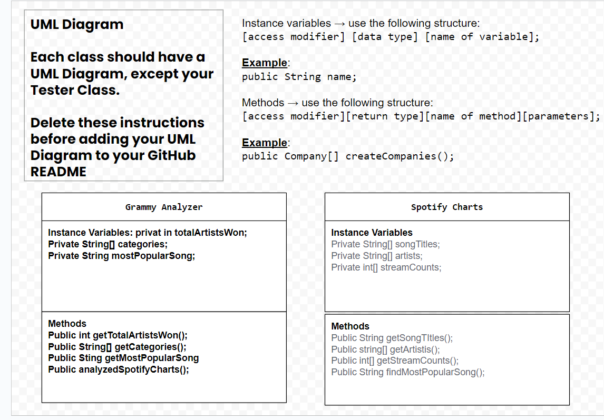

# UserStory-project

This project uses enhaned for loops and uses codes to help find data for a user story. 

# Unit 2 - Data for Social Good Project

## Introduction

Software engineers develop programs to work with data and provide information to a user. Each user has different needs based on the information they are looking for from data. Your goal is to create a data analysis program for your user that stores and analyzes data to provide the information they need.

## Requirements

Use your knowledge of object-oriented programming, one-dimensional (1D) arrays, and algorithms to create your data analysis program:
- **Write a class** – Write a class to represent your user or business and store and analyze their data with no-argument and parameterized constructors.
- **Create at least two 1D arrays** – Create at least two 1D arrays to store the data that your user needs information about.
- **Write a method** – Write a method that finds or manipulates the elements in a 1D array to provide the information your user needs.
- **Implement a toString() method** – Write a toString() method that returns general information about the data (for example, number of values in the dataset).
- **Document your code** – Use comments to explain the purpose of the methods and code segments and note any preconditions and postconditions.

## User Story 

As an acadmey member for the Grammys I want to analyze spotify charts so I can determine the potential grammy winners.

## Dataset 

Dataset: https://www.kaggle.com/datasets/ambaliyagati/spotify-dataset-for-playing-around-with-sql
- **Genre** (String) - genre of the song
- **Artists** (String) - name of the artists for their grammy winning song
- **Name** (String) - name of the grammy winning song
## UML Diagram 

 

## Description 
For my project, I created a program that lets the user explore a dataset of popular songs from 2024–2025, then giving them our grammy predicition winner. I added a dataset into ArrayLists and used a Song class with a constructor and instance variables to store each song’s title, artist, genre, streams, and other information. All Song objects were kept in one ArrayList so the program could loop through them easily. Then we used the Scanner class, the user can choose which data column the would like to see of the song such as genres or streams, then the program prints the results using if statements. This project shows how I used key concepts like objects, ArrayLists, loops, and user interaction, while also creating a userstory for the project.